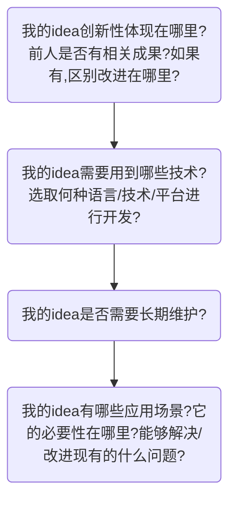

# **技术指导手册**

 ***——For 2019 “PPT Hackathon”***

> 为了帮助大家在比赛中快速上手，以及尽可能取得更多收获，我们编写了这个文档，以备参考。
>
> 方法论多种多样，希望大家有自己的想法，批判看待文中所述。预祝顺利！

[TOC]

------

### 一、入手

在着手开发时，入手阶段往往令人头疼。倘若在这一阶段拖延太久，后面的工作就无法推进，可能导致“思前想后良久，但由于种种顾虑拿不定主意”的情况出现。在毫无头绪时，通过视角上的变通，我们可以更好地审视某个事物。

以下提供几种入手思路：

##### 1、具体化

在拿到一个入口较宽的题目时，意味着较大的自由度，但过于宽泛却模糊容易让人难以下手。

*例如：你如何看待00后？*

*答：我觉得00后是一个有活力的群体，他们能够很快适应科技的发展，同时也有着广泛的兴趣爱好。相较于老一辈人，他们接受事物的能力更强。但或许是生活习惯和人生经历的问题，00后在面对一些事情时也会体现出不成熟的一面。*

这个回答好像说了很多，又好像什么都没说。似乎涵盖了对00后性格、能力、生活阅历等方面的看法，但又说的很空洞，缺乏理论依据，且论述分散。只是不断地发表出观点，但浅尝辄止，没有留下足够的内容。因为选择太多了，可以想到很多，也希望表达很多，但最后收效不佳。再看另一个：

*答：我觉得00后是拥抱信息时代的一代人。在这二十年中，国内计算机科学迅猛发展，AI、区块链、数据科学等产业从无到有，人们深刻感受到了信息科学的威力。而00后恰好都是亲历者，少年时就见证了这些变革。~~天选之子啊有木有！~~现如今，大部分家庭都拥有个人电脑和智能手机，发达的互联网让信息获取变得容易，使00后从小就有开阔的视野和使用科技设备的能力和热情。当下CS&SE&AI已经成为了热门专业，不难预料，未来信息技术产业将由00后掌舵。无论主动或被动，在这场浪潮中无人能置身事外，而00后耳濡目染，在有了足够的能力后，想必会有足够的热情和信心投身其中吧。*

通过这个刻意地有点尬的例子，大家应该也能找到关键了。后者只有一个切的深且准的观点，单刀直入，展开论证合理性，最后卖个情怀，有开有合。重要的不是数量的多少，而是思考的深度。

当然，要注意观点的选取，别找一个伪命题。

##### 2、分解

在拿到题目时，可以尝试将其细分为**相互间影响较小**的多个问题进行思考。问题被分解常常意味着难度下降，而各问题间关联度较低则意味着将它们分开考虑时不致出现相互纠缠影响。本次hackathon只确立主题，不规定具体题目，需要大家找到关键字（一眼便知）。个人经验是：要先对问题整体有个概念（这是最难的部分），接下来尝试拎出影响最大的若干个环节，分条列出，各个击破。此外，着手解决小的问题可以快速见到成效，提供正向反馈。说一千道一万，只有进行足够多的练习，才能总结出外科手术式的流程，能在遇到大多数问题时迅速将其分解（笔者目前还处于钝刀割肉的水平）。

##### 3、发散

很少有完全独立的事物，所以对待某个题目时，要尽可能发掘与之关联的内容，拓宽其深度和广度，这样有助于找到更加全面/新颖的方案。发散思维大家已经训练多年，不多赘述，通过合理的搜索也可以快速找到某个事物已有的发散方向（比如搜索“摄像头 AI” “区块链 版权”，如果出现相关内容就说明已有两者结合的理论或成果）。

##### 4、从小处切入

*现在的年轻人，不要总想着搞个大新闻。*

从小处切入，可以降低复杂性，一来足够敏捷，二来体系清晰，降低预判失误的概率。小的课题意味着可以集中精力处理问题，如果要做的事情太多，难免手忙脚乱，以及内容空洞。最初的愿景是美好乃至宏大的，但真正尝试后觉得，对于个人开发者而言，能做出一些小而美的成果也很酷。

> 另外，为了让大家有一个大体的思路，我们在这里提供一系列的引导性问题（作为参考）

------

### 二、可行性分析

一个想法的可行性受制于多种因素，通过检索相关内容的方式可以快速对其进行评估并得到有效的建议。

##### 1、Web Of Science

这是应用较广的学术检索平台，可以方便地查到以英文文献为主的学术论文。可以将自己的想法浓缩为若干关键字进行检索，再从结果中找到所需的成果进行参考。一般而言，综述对于快速了解前人所做的工作有良好的帮助，如果找到一篇不错的综述，也可以从论文引用中找到更完整的论文，对课题中某个角度进行深入了解。而记述了较新研究成果的论文有助于了解该课题新的的成果与大致研究方向（但不代表有继续往下做的价值）。

若在相关论文中未能找到，则有可能是之前学界尚未研究过的内容，需要自行探索。

##### 2、[Google Scholar](https://scholar.google.com/)

谷歌学术检索。通过该检索方式，可以找到多维度的相关内容，从产业到学术再到评论看法一应俱全。此外，不少内容可以用Chrome浏览器翻译为中文，降低了阅读难度。

比起学术类检索，它的内容涵盖更加丰富多样，但需要自行鉴别分析。好处就是可以听到不同的声音，有来自业界、学界的，也可能看到其他人的评论。在大量的相关信息中，经过初筛或许可以找到已经落地的相关成果和专利，如果是APP或实物产品，可以进行进一步的调查，有条件的话甚至可以亲自体验一下。

推荐搭配Google使用，能够获取到更多信息，且Google中内容质量相对较高，值得参考。

`Google Scholar 需要使用特殊方式访问`

##### 3、[Ebscohost](http://search.ebscohost.com/)

该检索可以对公司进行调查。从company information板块中可以对公司本身进行调查（国外公司），同时也可以选取某个公司查到它的专利、成果等。

通过它，我们可以看一下大厂的类似产品是怎么做的，如果不幸发现自己的idea已经被做出来了，也可以向其学习一下，和自己的思路进行对比。

<!--以上三个平台都是在教大家获取现有的成果。这可以较快地让自己的idea变得更加全面，毕竟，在开始实践之前，谁都不知道这里面有哪些坑，顺着前人的成果，至少能知道哪条路是通顺的，以及哪些问题是已经解决的。参考别人的成果，不代表要按照相同的思路去做，即便是解决相同的问题，也可以用不同的方式去试试，说不定效果会更好。实际上，受限于多种因素（最大的问题是自己太菜），一些论文里的工作在复现时可能遭遇种种困难，完全按照作者所述不见得能顺利完成。--> 

------

### 三、实现方式

从个人开发者的角度考虑，从底自顶地开发一个完整项目过于困难，除非是出于学习目的。应当充分借助现有平台以及开源库进行搭建。下面进行分类推荐：

##### 1、企业级开发平台

###### 综合性开发平台：[Microsoft Azure](https://www.azure.cn/zh-cn/)

涵盖物联网、AI、区块链、认知服务、数据分析等多种业务，开发工具全面，且提供一部分免费支持。Azure的整个体系在云平台中首屈一指。

###### AI：[百度飞桨](https://www.paddlepaddle.org.cn/)

在今年的八月底的WAIC上，第一天上午全程介绍了这个平台。这是一个开源的深度学习平台。有十分详细的开发文档和API。可以一试。

###### CV：[Face++](https://www.faceplusplus.com.cn/)

作为人脸识别的独角兽，旷视提供有一套很好的API。它好在明码标价，还好在价格不便宜。

###### 区块链：[FISCO BCOS](http://fisco-bcos.org/zh/)

开源的区块链开发平台，由微众银行编写并维护，有Java、python、node.js三种SDK，还提供了可视化工具--区块链浏览器。

##### 2、开源库

一般来说，开源库为某组织制定并维护规范，其中具体内容由不同开发者完成，产生一系列API。

###### [OpenGL](https://learnopengl-cn.github.io/)

计算机图形学的开源库。通常，这个库由显卡生产商维护。在抗锯齿、图像生成方面有着不错的效果。

###### [OpenCV](https://opencv.org/)

计算机视觉的开源库

###### [behaviac](http://www.behaviac.com/)

由腾讯推出的游戏AI的开发框架组件，也是游戏原型的快速设计工具。

> 以上部分用较为知名的开源平台/库进行举例，选取较为随意，旨在为大家提供思路，在具体实现时可能还需要调用其他开源项目。

------

水平所限，若有疏漏或建议，欢迎进行友好交流！

若有修增，会在相关部分署上提供者的名字。

邮箱：dreambackto1988@126.com

  